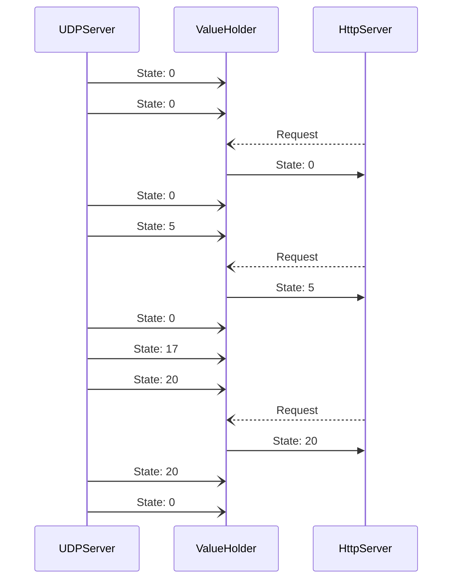

```mermaid
sequenceDiagram
    UDPServer-)ValueHolder: State: 0
    UDPServer-)ValueHolder: State: 0
    HttpServer--)ValueHolder: Request
    ValueHolder->>HttpServer: State: 0
    UDPServer-)ValueHolder: State: 0
    UDPServer-)ValueHolder: State: 5
    HttpServer--)ValueHolder: Request
    ValueHolder->>HttpServer: State: 5
    UDPServer-)ValueHolder: State: 0
    UDPServer-)ValueHolder: State: 17
    UDPServer-)ValueHolder: State: 20
    HttpServer--)ValueHolder: Request
    ValueHolder->>HttpServer: State: 20
    UDPServer-)ValueHolder: State: 20
    UDPServer-)ValueHolder: State: 0
```
