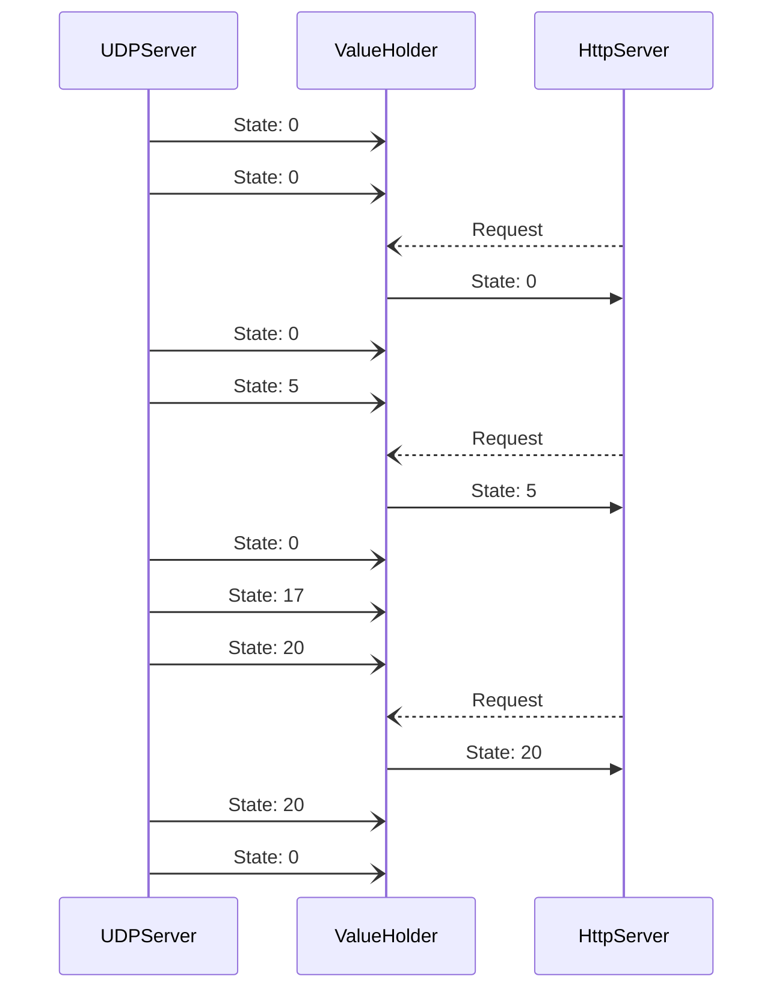

# UdpState Collector

## Overview

The UdpStateCollector project is designed to collect and distribute state from a UDP server over a restful api.



## Usage

```bash
udp_listener [flags]
# Flags:
#   Debug Flags:
#       --verbose(-v): set log level to debug mode
#   General Flags:
#       --listen-addr(-l): IP of network interface to listen on (both http and udp server) (default: 0.0.0.0[global])
#       --http-port(-p): HTTP server listen port (default: 8080)
#       --udp-port(-u): UDP server listen port (default: 7982)
#       --udp-buffer-size(-b): Maximum Size of a packet received from UDP port (default: 2048[byte])
#   Security Flags:
#       --user: Http basic auth user (syntax: <user>:<password>) [must be url encoded]
#       --allowed-udp-clients: filter udp clients and just accept packets from listed addresses (IP address e.g. 192.168.200.15)
#    Debug Command
#       send <data> [flags]
#           --ip(-i): target IP address (default: 127.0.0.1)
#           --port(-p): target Port number (default: 7982)
#           --local-port(-l): local port used to send UDP packets (default: 7983)
```

### Send Request to HTTP

```

## Getting Started

To initialize the project, follow these steps:

1. Navigate to the project directory:

    ```sh
    cd udp_listener
    ```

2. Install the required dependencies:

    ```sh
    go mod tidy
    ```

3. Run the UdpStateCollector:

    ```sh
    go run main.go
    ```
